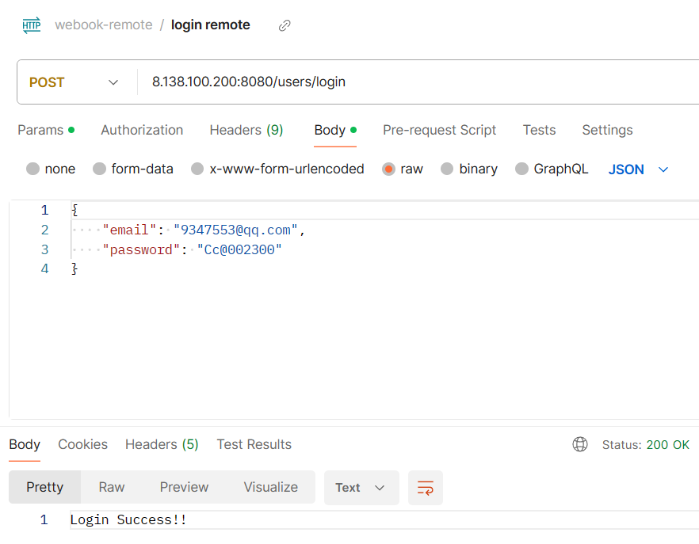
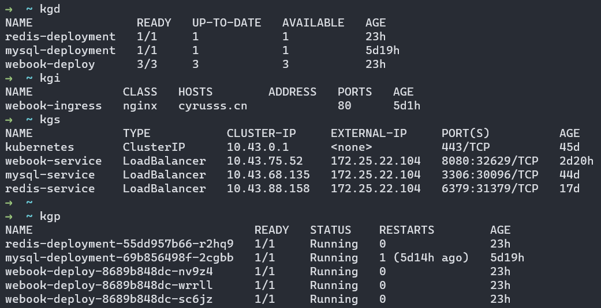

# 第三次作业
`(没有修改端口)`


### 1.部署了Jenkins流水线

`Jenkinsfile`在`basic_go/script/Jenkinsfile`

```Jenkinsfile
pipeline {
    agent {
        label 'node'
    }
    environment {
        // 配置代理
        def http_proxy="http://127.0.0.1:10809"
        def https_proxy="http://127.0.0.1:10809"
        def no_proxy="localhost,127.0.0.1"
        def KUBECONFIG="~/.kube/config"
    }

    stages {
        stage('Pull && Build') {
            steps {
                // git pull 拉取镜像
                sh 'cd basic_go && git pull origin main'
                // docker build 打包镜像
                sh 'docker build --network host -f basic_go/script/Dockerfile -t webook:test .'
            }
        }
        stage('UPLOAD') {
            steps {
                // 上传到阿里云镜像仓库, 以便kubernetes使用
                sh 'docker tag webook:test registry.cn-hangzhou.aliyuncs.com/webook/webook:test'
                sh 'docker login registry.cn-hangzhou.aliyuncs.com -u Cyrusss -p '
                sh 'docker push registry.cn-hangzhou.aliyuncs.com/webook/webook:test'
            }
        }
        stage('Kube Run') {
            steps {
                // 使用kubenetes部署
                sh 'sudo kubectl apply -f basic_go/script/webook-deploy.yml'
            }
        }
    }
}


```

~~仓库密码暴露了,有待解决这个问题~~

Jenkins部署在阿里云服务器`http://47.113.221.65:8080/`


### 2.流水线自动打包webook镜像

`Dockerfile`在`basic_go/script/Dockerfile`

```dockerfile
# Dockerfile for webook
# Build src code
FROM golang:latest AS buildstage

# Use proxy
ENV HTTP_PROXY http://127.0.0.1:10809
ENV HTTPS_PROXY http://127.0.0.1:10809

WORKDIR /go/src

ADD . /go/src

RUN cd /go/src/basic_go && go build -o main ./webook/

# Reduce iamge size (Final ~100mb)
FROM ubuntu:22.04

WORKDIR /app

COPY --from=buildstage /go/src/basic_go/main /app/

ENTRYPOINT ./main
```


### 3.通过Loadbalancer部署mysql和redis

阿里云Loadbalancer

开发环境和测试环境均可直接连接

service配置文件如下

```yaml
apiVersion: v1
kind: Service
metadata:
  name: mysql-service.go
spec:
  selector:
    app: mysql
  ports:
    - protocol: TCP
      port: 3306
      targetPort: 3306
  type: LoadBalancer

=====================

apiVersion: v1
kind: Service
metadata:
  name: redis-service.go
spec:
  selector:
    app: redis
  ports:
    - protocol: TCP
      port: 6379
      targetPort: 6379
  type: LoadBalancer
```


### 截图

成功从远程服务器登录


kube实例
